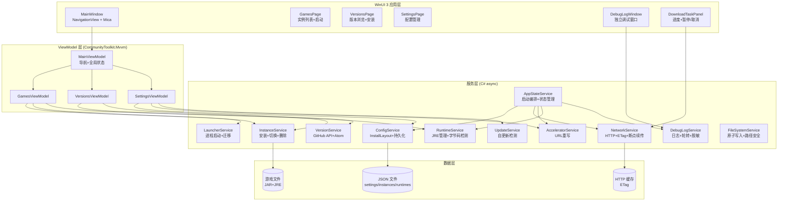

## 产品概述

将现有 MindustryLauncher（Tauri 2 Rust + React 启动器）全面破坏性重构为 WinUI 3 (C# + XAML) 桌面应用，严格遵循 Windows Fluent Design 设计语言。应用功能保持完整等价：Mindustry 多频道游戏版本发现、断点续传下载安装、JRE 运行时自动管理、游戏进程启动、GitHub 加速源、调试日志系统、启动器自更新检测。

## 核心功能

- **游戏实例管理**：查看已安装实例列表、启动游戏、配置 JVM 参数（内存/额外参数）、删除实例
- **版本浏览与安装**：按频道（Mindustry/MindustryX/BE/XBE）筛选远程版本、安装新版本、切换版本（含确认对话框）、断点续传下载与 SHA256 校验
- **JRE 运行时管理**：自动安装所需 JRE（Adoptium 元数据 + TUNA 镜像）、导入本地 JRE、扫描系统 JRE、启用/禁用/删除运行时
- **设置页**：安装根目录迁移、频道可见性配置、GitHub 加速源选择与刷新、HTTP 代理、调试模式开关
- **下载任务面板**：实时进度（字节/速度/百分比）、暂停/恢复/取消操作、状态通知
- **调试日志**：文件日志轮转、敏感信息脱敏、独立调试窗口查看
- **启动器自更新**：检测 GitHub 最新版本、忽略版本、Atom feed 兜底
- **Fluent Design 体验**：Mica 材质背景、亮/暗主题自适应、NavigationView 响应式导航、原生控件外观、流畅过渡动画

## 技术栈

- **UI 框架**：WinUI 3 (Windows App SDK 1.6+) + XAML
- **语言**：C# 12 / .NET 8 (LTS)
- **部署模式**：Unpackaged 自包含单文件 exe（Bootstrap 初始化，非 MSIX）
- **序列化**：System.Text.Json（camelCase 与现有数据格式兼容）
- **HTTP**：HttpClient + HttpClientHandler（ETag 缓存、断点续传、代理）
- **压缩**：System.IO.Compression.ZipArchive（JRE 解压、JAR 字节码检测）
- **加密**：System.Security.Cryptography.SHA256
- **日志**：自定义文件日志（轮转、脱敏，保持与现有行为一致）
- **MVVM**：CommunityToolkit.Mvvm（ObservableObject, RelayCommand, ObservableProperty）
- **文档依据**：context7 获取的 WinUI 3 Gallery 官方文档（库 ID: /microsoft/winui-gallery，990 snippets，高声誉）

## 实现方案

### 总体策略

将现有 14 个 Rust 后端模块逐一等价移植为 C# 服务层，前端从 React 单组件重建为 WinUI 3 XAML 页面系统。通信模式从 Tauri invoke/listen/Channel 转变为 C# 原生 async/await + IProgress<T> + 事件。数据格式（JSON camelCase）保持兼容，确保用户现有安装数据无缝迁移。

### Rust → C# 模块映射

| Rust 模块 | C# 对应 | 关键移植点 |
| --- | --- | --- |
| `models.rs` | `Models/` 目录（record 类型） | GameChannel 枚举、所有数据模型，System.Text.Json camelCase |
| `error.rs` | `AppException` 自定义异常 | 6 种错误类型（Io/Network/Json/Invalid/NotFound/Command） |
| `fs_util.rs` | `Services/FileSystemService.cs` | 原子写入（tmp→rename）、目录递归复制、路径安全断言、重试删除 |
| `config.rs` | `Services/ConfigService.cs` | InstallLayout 目录结构、便携数据目录定位（exe 旁 MindustryLauncherData/）、install-root.json 指针 |
| `network.rs` | `Services/NetworkService.cs` | ETag 缓存、断点续传（Range header）、暂停/取消/恢复（CancellationTokenSource + ManualResetEventSlim）、SHA256 校验、ConcurrentDictionary 管理下载控制 |
| `accelerators.rs` | `Services/AcceleratorService.cs` | 内嵌 JSON 资源（Embedded Resource）、URL 重写规则、GitHub URL 分类（API/Raw/ReleaseAsset） |
| `versions.rs` | `Services/VersionService.cs` | 4 频道并行查询（Task.WhenAll）、Atom feed 正则解析兜底、expanded_assets HTML 解析、桌面 JAR 评分选择 |
| `instances.rs` | `Services/InstanceService.cs` | 安装流程（下载→校验→JRE 检测→创建实例）、切换（安装+清理旧实例）、安全路径清理 |
| `runtime.rs` | `Services/RuntimeService.cs` | Adoptium API 元数据获取、TUNA URL 重写、JRE zip 解压、java -version 输出解析、JAR .class 字节码 major version 检测、系统运行时扫描（JAVA_HOME/PATH） |
| `launcher.rs` | `Services/LauncherService.cs` | JVM 参数构建（-Xms/-Xmx/-Dmindustry.data.dir）、分离进程 spawn（Process.Start + CREATE_NO_WINDOW）、安装根迁移（路径重写） |
| `update.rs` | `Services/UpdateService.cs` | GitHub API + Atom feed 双路径版本检测、semver 比较 |
| `debug_console.rs` | `Services/DebugLogService.cs` | 文件日志、2MB 轮转、最多 4 个归档、URL 凭据/敏感参数正则脱敏、独立调试窗口 |
| `lib.rs` | `App.xaml.cs` + `Services/AppStateService.cs` | 启动流程编排、LauncherState 等价（Settings + Accelerators 并发读写） |


### 通信模式转换

| Tauri 模式 | C# 等价 |
| --- | --- |
| `invoke` (请求-响应) | `async Task<T>` 服务方法直接调用 |
| `listen` (事件推送) | `event Action<T>` 或 `IObservable<T>`（版本刷新完成通知） |
| `Channel<TaskEvent>` (流式进度) | `IProgress<TaskEvent>` + `ConcurrentDictionary<string, DownloadControl>` |


### Unpackaged 部署要点

- `.csproj` 配置 `WindowsPackageType=None` + `SelfContained=true` + `PublishSingleFile=true`
- `Program.cs` 中调用 `Bootstrap.Initialize()` 完成 Windows App SDK 初始化
- 便携数据目录逻辑保持不变：`exe目录/MindustryLauncherData/` 下存放 install-root.json 指针
- 非 MSIX 模式下 Mica 背景需通过 `MicaController` + `SystemBackdrop` 在 code-behind 中手动配置

## 实现注意事项

- **数据兼容性**：JSON 文件路径和 camelCase 序列化必须与现有 Rust 端完全一致（`settings.json`、`instances.json`、`runtimes.json`、`versions.json` 缓存），确保用户升级后数据不丢失
- **下载控制线程安全**：Rust 用 `AtomicBool` + `Notify`，C# 用 `CancellationTokenSource`（取消）+ `ManualResetEventSlim`（暂停/恢复）+ `ConcurrentDictionary`（任务注册表），行为须等价
- **JAR 字节码检测**：读取 .class 文件头 `CAFEBABE` + major version（offset 6-7），映射 Java feature version（major - 44），与现有 `java_feature_from_class_major` 逻辑一致
- **进程隐藏窗口**：Windows 上 `ProcessStartInfo.CreateNoWindow = true` + `WindowStyle = Hidden`，等价于 Rust 的 `CREATE_NO_WINDOW` flag
- **原子写入**：保持 tmp→rename 模式（`File.Write` → `File.Move` with overwrite），避免写入中断导致配置损坏
- **路径安全**：`assert_inside_root` 逻辑需移植，防止路径遍历攻击删除安装根外文件
- **单文件控制**：每个 C# 文件不超过 400 行，服务类按职责拆分，XAML code-behind 仅处理 UI 交互，业务逻辑在 ViewModel 中
- **日志脱敏**：正则 `://([^:/@\s]+):([^/@\s]+)@` 和 `(?i)\b(token|password|passwd|secret|access_token)=([^\s&]+)` 需等价移植

## 架构设计



## 目录结构

```
MindustryLauncher/                    # 项目根
├── legacy/                           # [归档] 原 Tauri 工程完整保留
│   ├── src/                          # 原 React 前端
│   ├── src-tauri/                    # 原 Rust 后端
│   ├── package.json
│   ├── vite.config.ts
│   └── ...
├── MindustryLauncher/                # [NEW] WinUI 3 主项目
│   ├── MindustryLauncher.csproj      # [NEW] .NET 8 + WinUI 3 unpackaged 配置
│   ├── App.xaml                      # [NEW] 应用资源入口，合并 ResourceDictionary
│   ├── App.xaml.cs                   # [NEW] 应用生命周期、Bootstrap 初始化、启动编排
│   ├── Program.cs                    # [NEW] 入口点，Windows App SDK Bootstrap
│   ├── Models/
│   │   ├── GameChannel.cs            # [NEW] GameChannel 枚举 + label/as_id 方法
│   │   ├── DataModels.cs             # [NEW] Settings/InstalledInstance/RuntimeInfo/RemoteVersion/RemoteRuntime/ReleaseAsset/LaunchSettings/AppUiState/LauncherUpdateInfo/TaskEvent/DebugLogSnapshot 等 record 类型
│   │   └── AcceleratorModels.cs      # [NEW] Accelerator/AcceleratorList/AcceleratorRule/AcceleratorSupports
│   ├── Services/
│   │   ├── AppStateService.cs        # [NEW] 启动编排：加载设置→清理部分下载→初始化日志→扫描系统运行时→加载加速器。持有 Settings + Accelerators 并发状态
│   │   ├── FileSystemService.cs      # [NEW] 原子 JSON 写入(tmp→rename)、目录递归复制、路径安全断言(assert_inside_root)、重试删除
│   │   ├── ConfigService.cs          # [NEW] InstallLayout 目录结构、便携数据目录定位、install-root.json 指针、settings/instances/runtimes 持久化
│   │   ├── NetworkService.cs         # [NEW] HttpClient 封装、ETag 缓存、断点续传(Range header)、暂停/取消/恢复(CancellationTokenSource+ManualResetEventSlim)、SHA256 校验、ConcurrentDictionary 下载控制
│   │   ├── AcceleratorService.cs     # [NEW] 内嵌 JSON 资源加载、远程获取、URL 重写(rewrite_github_url)、github_url_candidates、URL 分类
│   │   ├── VersionService.cs         # [NEW] 4 频道并行查询、GitHub API JSON 反序列化、Atom feed 正则兜底、expanded_assets HTML 解析、桌面 JAR 评分选择、缓存合并
│   │   ├── InstanceService.cs        # [NEW] install_version(下载→校验→JRE检测→创建实例)、switch_version(安装+清理旧)、delete_instance、cleanup_partial_downloads、safe_path_part
│   │   ├── RuntimeService.cs         # [NEW] ensure_runtime(Adoptium API+TUNA URL)、list_remote_runtimes(TUNA HTML 解析)、install_runtime、import_runtime、scan_runtimes、scan_system_runtimes、required_java_from_jar(字节码检测)、detect_java_details
│   │   ├── LauncherService.cs        # [NEW] launch_version(JVM参数构建+分离spawn)、migrate_install_root(路径重写)、open_install_root、open_url、split_command_args
│   │   ├── UpdateService.cs          # [NEW] check_launcher_update(GitHub API+Atom兜底)、parse_semver、version_is_newer
│   │   └── DebugLogService.cs        # [NEW] 文件日志、2MB轮转、4归档限制、URL凭据/敏感参数正则脱敏、snapshot读取、clear、独立调试窗口打开
│   ├── ViewModels/
│   │   ├── MainViewModel.cs          # [NEW] 导航状态(view切换)、全局 AppState、忙碌管理(runWithBusy等价)、通知消息、Toast、下载任务集合(ObservableCollection<TaskRecord>)
│   │   ├── GamesViewModel.cs         # [NEW] 已安装实例列表、启动游戏、打开启动设置对话框、删除确认
│   │   ├── VersionsViewModel.cs      # [NEW] 频道筛选、版本列表、安装/切换操作(含IProgress<TaskEvent>)
│   │   ├── SettingsViewModel.cs      # [NEW] 设置草稿、保存、频道可见性单选、加速源刷新、迁移根目录、更新检测
│   │   └── RuntimeViewModel.cs       # [NEW] 运行时列表、远程运行时目录、安装/导入/扫描/启用/禁用/删除
│   ├── Views/
│   │   ├── MainWindow.xaml           # [NEW] NavigationView(PaneDisplayMode=Auto, 3 items) + Frame + 下载任务面板(右侧) + InfoBar通知区
│   │   ├── MainWindow.xaml.cs        # [NEW] Mica背景配置、导航事件、主题切换
│   │   ├── GamesPage.xaml            # [NEW] 实例卡片列表(GridView)、每张卡片含精灵图+版本+启动按钮+配置按钮+删除按钮
│   │   ├── GamesPage.xaml.cs         # [NEW] 启动设置对话框(ContentDialog)、删除确认对话框
│   │   ├── VersionsPage.xaml         # [NEW] 频道筛选栏 + 版本列表(ListView)、每项含版本号+发布日期+预发布标记+安装/切换按钮
│   │   ├── VersionsPage.xaml.cs      # [NEW] 切换确认对话框
│   │   ├── SettingsPage.xaml         # [NEW] SettingsCard分组：安装目录+迁移、频道可见性、加速源选择+刷新、HTTP代理、调试模式、更新检测
│   │   ├── SettingsPage.xaml.cs      # [NEW] 文件夹选择器(Picker)、保存逻辑
│   │   ├── DebugLogWindow.xaml       # [NEW] 独立窗口：日志文本框+刷新+清空+打开目录按钮
│   │   └── DebugLogWindow.xaml.cs    # [NEW] 日志轮询刷新
│   ├── Controls/
│   │   ├── DownloadTaskCard.xaml     # [NEW] 单个下载任务卡片：标签+ProgressBar+速度+暂停/恢复/取消按钮
│   │   ├── RuntimeCard.xaml          # [NEW] 运行时卡片：版本+来源+状态+操作按钮
│   │   └── InstanceCard.xaml         # [NEW] 游戏实例卡片：精灵图+频道标签+版本+操作按钮
│   ├── Styles/
│   │   ├── ThemeResources.xaml       # [NEW] ResourceDictionary.ThemeDictionaries(Light/Dark)：品牌色、频道色、卡片背景色、状态色等自定义画刷
│   │   ├── ControlStyles.xaml        # [NEW] 自定义控件样式：InstanceCardStyle、RuntimeCardStyle、DownloadTaskCardStyle、ChannelBadgeStyle
│   │   └── Typography.xaml           # [NEW] 排版资源：标题/副标题/正文 TextBlock 样式，基于 WinUI 原生 TypeScale
│   ├── Assets/
│   │   ├── mindustry/                # [复制] 游戏精灵图(alpha/core-shard/lancer/zenith.png)
│   │   └── github-accelerators.json  # [复制] 内嵌加速器列表(Embedded Resource)
│   └── Properties/
│       └── launchSettings.json       # [NEW] 开发调试配置
├── Resources/
│   └── github-accelerators.json      # [保留] 原始加速器列表(legacy 参考)
├── scripts/
│   └── build.ps1                     # [NEW] 构建脚本：dotnet publish -c Release -r win-x64 --self-contained -p:PublishSingleFile=true
├── AGENTS.md
├── CODEBUDDY.md                      # [修改] 更新架构说明为 WinUI 3
└── README.md                         # [修改] 更新构建说明
```

## 关键代码结构

### TaskEvent 流式进度模型（C# 等价于 Rust TaskEvent 枚举）

```
// Models/DataModels.cs
public record TaskEvent(
    string EventName,  // "started" | "progress" | "paused" | "finished" | "canceled" | "failed"
    TaskEventData Data
);

public record TaskEventData(
    string TaskId,
    string? Label,
    long? DownloadedBytes,
    long? TotalBytes,
    long? BytesPerSecond,
    string? Message
);

// 下载控制（等价于 Rust DownloadControl + AtomicBool + Notify）
public sealed class DownloadControl
{
    public CancellationTokenSource Cts { get; } = new();
    public ManualResetEventSlim PauseEvent { get; } = new(initialState: true);
    public bool IsCanceled => Cts.IsCancellationRequested;
    public bool IsPaused => !PauseEvent.IsSet;
    public void Pause() => PauseEvent.Reset();
    public void Resume() => PauseEvent.Set();
    public void Cancel() { Cts.Cancel(); PauseEvent.Set(); }
}
```

### InstallLayout 目录结构（等价于 Rust config.rs）

```
// Services/ConfigService.cs
public sealed record InstallLayout(
    string Root,
    string ConfigDir, string CacheDir, string DownloadsDir, string TmpDownloadsDir,
    string VersionsDir, string InstancesDir, string RuntimesDir, string LogsDir
)
{
    public static InstallLayout Create(string root) => new(
        root,
        Path.Combine(root, "config"),
        Path.Combine(root, "cache"),
        Path.Combine(root, "downloads"),
        Path.Combine(root, "downloads", "tmp"),
        Path.Combine(root, "versions"),
        Path.Combine(root, "instances"),
        Path.Combine(root, "runtimes"),
        Path.Combine(root, "logs")
    );

    public string SettingsPath => Path.Combine(ConfigDir, "settings.json");
    public string InstancesPath => Path.Combine(ConfigDir, "instances.json");
    public string RuntimesPath => Path.Combine(ConfigDir, "runtimes.json");
    public string VersionsCachePath => Path.Combine(CacheDir, "versions.json");
    public void Ensure() { /* 创建所有子目录 */ }
}
```

## 设计风格

严格遵循 Windows Fluent Design 设计语言，应用外观、交互和行为与 Windows 原生应用高度一致。使用 WinUI 3 原生控件体系，配合 Mica 材质背景营造层次感和深度感。

### 整体布局

主窗口采用 NavigationView 左侧导航栏（PaneDisplayMode="Auto"），宽屏显示展开侧边栏，窄屏自动收为紧凑图标模式或顶部模式。内容区使用 Frame 承载三个页面：游戏库、版本浏览、设置。右侧固定区域为下载任务面板，底部为 InfoBar 通知区。

### 页面设计

**GamesPage（游戏库）**：

- GridView 卡片网格布局，每张卡片为 InstanceCard 控件
- 卡片含游戏精灵图（左侧）、频道徽章、版本号、安装日期
- 卡片底部操作栏：启动按钮（AccentButton）、配置按钮、删除按钮
- 空状态显示 TeachingTip 引导安装

**VersionsPage（版本浏览）**：

- 顶部频道筛选栏（单选 ToggleButton 组）
- ListView 版本列表，每项含版本号、发布日期、预发布标记（InfoBar Severity="Warning"）
- 每项右侧操作按钮：安装（已安装则显示"已安装"禁用态）/ 切换

**SettingsPage（设置）**：

- SettingsCard 分组：安装目录（路径显示 + 迁移按钮 + 打开目录）、频道可见性（RadioButton 单选）、加速源（ComboBox + 刷新按钮）、HTTP 代理（TextBox）、调试模式（ToggleSwitch）、更新检测（按钮 + 结果展示）

**DownloadTaskPanel（下载任务面板）**：

- 右侧固定面板，垂直排列下载任务卡片
- 每张卡片：任务标签 + ProgressBar + 速度/大小文本 + 暂停/恢复/取消按钮
- 完成后 3.2 秒淡出消失

**DebugLogWindow（调试窗口）**：

- 独立窗口，深色主题
- 全屏 TextBox 只读日志 + 顶部 CommandBar（刷新/清空/打开目录）

### 主题与材质

- 窗口背景：MicaBackdrop（Kind="Base"），配合透明内容区实现原生毛玻璃
- 主题：通过 Application.RequestedTheme 切换 Light/Dark，ResourceDictionary.ThemeDictionaries 自动适配
- 自定义资源：在 ThemeResources.xaml 中定义品牌色、频道色等自定义画刷，Light/Dark 双套

### 动画与交互

- 页面切换：NavigationView 内置 SlideNavigationTransitionInfo
- 卡片悬停：WinUI 内置 PointerOver visual state（轻微缩放 + 阴影变化）
- 按钮反馈：内置 Pressed visual state（缩放动画）
- 下载进度：ProgressBar 内置流畅动画
- ContentDialog：内置弹出/关闭动画
- InfoBar：内置展开/折叠动画

### 响应式

- NavigationView PaneDisplayMode="Auto"：宽屏 Left → 中屏 Compact → 窄屏 Top
- GridView 自适应列数（x:Bind AdaptiveGridView）
- 最小窗口尺寸 1024x640（与现有 Tauri 配置一致）

## Agent Extensions

### MCP

- **context7**
- Purpose: 获取 WinUI 3 及 Fluent Design 最新官方文档作为开发依据，包括 NavigationView 用法、Mica 背景配置、ThemeDictionaries 主题资源、unpackaged 部署、Connected Animation 等
- Expected outcome: 每个实现阶段获取对应主题的代码示例和最佳实践，确保 UI 代码严格遵循官方规范

### Skill

- **frontend-design**
- Purpose: 指导 Fluent Design 视觉决策，包括色彩系统、排版层次、控件样式、动画交互的审美判断，确保设计不流于模板化
- Expected outcome: 在样式资源字典和页面 XAML 编写阶段提供设计指导，确保视觉一致性和原生体验

### SubAgent

- **code-explorer**
- Purpose: 在 C# 后端移植阶段，快速检索 legacy/ 目录中 Rust 源码的具体实现细节（如正则表达式、URL 构建逻辑、错误处理路径），确保移植等价性
- Expected outcome: 精确定位需移植的 Rust 函数签名和逻辑分支，减少遗漏和回归